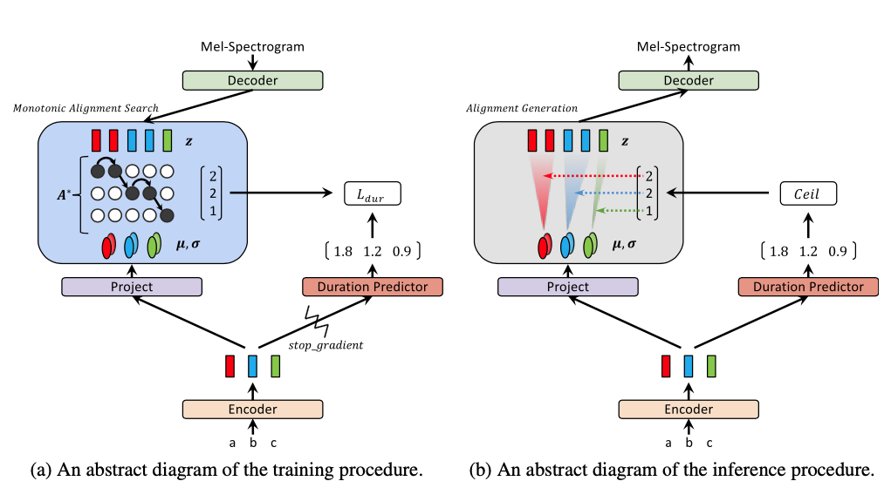

# 1. TTS 모델 선택

## 선택한 모델

- TTS : [Glow-TTS](https://arxiv.org/pdf/2005.11129.pdf)

  - alignment의 학습이 필요 없는 flow based generative TTS model
    - alignment : 텍스트와 음성 간의 정렬 과정
      1. 각 단어가 어떻게 발음되는지를 결정하는 정보 추출
      2. 음성 신호를 분석하여, 발생하는 시간과 주파수 정보를 추출
      3. 발음 정보와 음성 신호 정보를 대조하여, 각 단어와 음성 신호의 시간 매핑을 수행합니다. 이 과정에서 단어의 시작 시점과 끝 지점을 결정합니다
      4. alignment를 통해 매핑된 정보를 기반으로, 각 단어의 발음 정보에 따라 음성을 생성
  - 학습 및 추론 과정
    

  1. 텍스트 스퀀스 $c$가 조건으로 들어갔을 때 Mel-Spectogram $X$의 분포, $P_X(x|c)$을 구하는 것이 목표

     

  2. 이 분포들을 모델링하기 위하여 네트워크 파라미터 $\theta$와 alignment function $A$를 이용

     데이터의 log-likelihood를 최대화 하는 세타와 $A$를 구한다.

     

  3. A를 바로 구할 수는 없기 때문에

  1) 현재 $\theta$에서 가장 좋은 $A^*$를 구하고
      2. $A^*$를 사용한 $\log P_X$를 최대화 시킬 수 있는 $\theta$를 구한다.
     이를 반복적으로 하면서 두 파라미터를 점점 최적화

  1. 추론시에 $A^*$를 찾기 위해 별도의 duration predictor $f_{dur}$를 훈련

     

- Vocoder : [HiFi-GAN](https://arxiv.org/pdf/2010.05646.pdf)

  - 개요
    - 음성 합성은 크게 두 단계(1: Mel-Spectogram 생성, 2: Mel에서 Wave form 생성)로 나누어지는데 Vocoder가 2의 역할을 함
    - 최근 Wave Form 생성에 적대적 생성 신경망을 많이 사용하고 있지만 성능이 자동 회귀 모델에 미치지는 못하고 있음
    - 하지만 Hifi-GAN은 GAN을 사용하고도 효율과 정확도를 모두 충족 시킴
  - Traiging Loss

    1.  **GAN Loss: :**
         GAN 훈련 방법론은 LS-GAN [Mao17]을 이용. $x$는 Ground truth 오디오, $s$는 멜스펙트로그램
        
    2.  **Mel-Spectrogram Loss :**

        두 Wave Form의 Mel-Spectogram의 $L_1$ 거리. 파이는 오디오를 Mel로 바꾸어주는 함수. 이 로스는 오디오를 보다 사실적으로 만들어주고 훈련 초반 stability도 높여준다.

        

    3.  **Feature Matching Loss :**

        discriminator의 각 레이어의 feature들 간의 $L_1$ 거리. $D^i$는 discriminator의 $i$번째 레이어의 피쳐맵. $N_i$는 피쳐갯수.

        

### Vocoder란?

TTS(Text-to-Speech) 모델에서 생성된 mel-spectrogram을 음성으로 바꾸는 역할

## 모델 선택 이유

- Tacotron2 보다 빠른 합성 속도
- CPU 성능만으로 음성 합성을 수행 가능
- 자세한 Refrence Code
  - [SCE-TTS](https://sce-tts.github.io/#/) : Colab을 활용한 Glow-TTS 및 HiFi-GAN 학습 코드 제공

# 2. 학습을 위한 데이터

1. **[음성 데이터 구축을 위한 한국어 코퍼스](https://github.com/sce-tts/mimic-recording-studio/blob/master/backend/prompts/korean_corpus.csv)** 3922문장을 직접 녹음
2. 편리한 녹음을 위한 웹 페이지 구축

   

3. python library를 활용하여 학습을 위한 데이터로 변환

# 3. 음성 합성 결과

1. **아래 문장들은 모델 학습을 위해 사용하지 않은 문장들입니다.**

[sample1.wav](./ai/asset/sample1.wav)

1. **경찰청 철창살은 외철창살이고 검찰청 철창살은 쌍철창살이다.**

[sample2.wav](./ai/asset/sample2.wav)

# 4. 학습한 목소리를 편리하게 사용할 수 있는 파이썬 서버 배포

- FastAPI를 활용하여 서버 구축
- URI만으로 TTS 사용 가능
  - ~~https://j8a703.p.ssafy.io/ai/infer/?text=[TTS할 문장]&voice=1~~(서버종료)


# Git

## Git Flow~

```
💡 우리가 사용하는 Branch

master : 제품으로 출시될 수 있는 브랜치 ⇒ 마지막에 merge 할듯

develop : 다음 출시 버전을 개발하는 브랜치 ⇒ merge할때마다 자동배포

feature : 기능을 개발하는 브랜치 → EPIC과 연동
```

</aside>

### Hotfix 수정사항을 작업중인 branch에 적용시킬때

```
💡 feature에서 기능 개발 중일때 

**hotfix를 통해 급하게 중요한 부분이 develop에 변경되었을때**

현재 feat/be/sng에서 작업중이라고 가정
1. local develop branch의 변경사항을 최신화 시킨다
 ⇒ git switch develop
   git pull

2. sng 브랜치를 develop 브랜치와 merge 시켜 최신화 시키고 작업한다.
  ⇒ git switch feature/be/sng
    git merge --no-ff develop
```

</aside>

### 기능개발 후에 develop에 merge 시킬때 (local에서 rebase방법)

```
💡 feature에서 기능 개발 후 develop에 머지 시킬때
   *현재 feat/be/sng에서 작업완료라고 가정
   **(만약 develop에 아직 merge된게 없을 경우 3번부터 시작하면 된다!!)

  1. local 에서 remote의 변경사항을 인지 시킨다
   ⇒ git fetch

  2. sng 브랜치를 develop 브랜치와 rebase 시킨다.
   ⇒ git rebase origin/develop

  3. rebase 중 충돌이 발생한다면 3번 과정을 반복하며 충돌을 해결한다.
   ⇒ git status 를 통해 충돌이 난 file을 찾아서 충돌을 해결한다.
     git add 를 통해 충돌 해결한 부분을 add 한다.
     git rebase —continue를 통해 rebase를 다시 진행시킨다.


  3.5 기능테스트를 해본다.

  4. rebase된 sng 브랜치를 push 한다
    ⇒ git push —force

  5. remote에서 merge request를 보내 팀의 리더가 확인한 후 merge 시킨다

  6. remote develop이 merge 됬으면 내가 생각했을때 가장 편한 방법은
     local develop branch를 지우고 최신 변경사항을 인지시킨후 
     다시 switch로 가져오는것
    ⇒ git branch -D develop
      git fetch
      git switch develop
```

</aside>

### 기능개발 후에 develop에 merge 시킬때 (remote 에서 rebase)

```
💡 feature에서 기능 개발 후 develop에 머지 시킬때
   *현재 feat/be/sng에서 작업완료라고 가정

  1. git status를 통해 commit할 내역을 확인한 후에 add,commit,push
   ⇒ git status
     git add .
     git commit -m “feat : ~" 
     git push origin feat/be/sng

  2. remote에서 merge request를 보내면 rebase가 필요할때 rebase 버튼이 생성된다.
   ⇒ gitLab에 따로 설정하겠습니다. 충돌이 있다면 remote에서 해결

  3. remote develop이 merge 됬으면 내가 생각했을때 가장 편한 방법은
     local develop branch를 지우고 최신 변경사항을 인지시킨후 
     다시 switch로 가져오는것
   ⇒ git branch -D develop
     git fetch
     git switch develop
```

</aside>

- 참고블로그
  
  [충돌 없는 Git을 위해 Git Flow에 대해 알아보자](https://velog.io/@couchcoding/충돌-없는-Git을-위해-Git-Flow에-대해-알아보자)
  
  [우린 Git-flow를 사용하고 있어요 | 우아한형제들 기술블로그](https://techblog.woowahan.com/2553/)

## 

## Branch Convention

```
💡 ex) feat/be/login
       feat/fe/login
```

## Commit Convention

| 커밋 타입    | 리스트                                     |
| -------- | --------------------------------------- |
| feat     | 기능 (새로운 기능)                             |
| fix      | 버그 (버그 수정)                              |
| design   | CSS 등 사용자 UI 디자인 변경                     |
| refactor | 리팩토링                                    |
| style    | 스타일 (코드 형식, 세미콜론 추가 : 비즈니스 로직에 변경 없음)   |
| docs     | 문서 (문서 추가, 수정, 삭제)                      |
| test     | 테스트 (테스트 코드 추가, 수정, 삭제: 비즈니스 로직에 변경 없음) |
| chore    | 기타 변경사항 (빌드 스크립트 수정 등)                  |
| post     | 블로그 포스트 추가 (신규 포스트 작성 및 수정)             |
| rename   | 파일 혹은 폴더명을 수정하거나 옮기는 작업만 하는 경우          |
| remove   | 파일을 삭제하는 작업만 수행한 경우                     |

```
💡 ex) feat : ~~기능 구현
```

</aside>

## Git Convention

```
💡 참고사항

1. 에픽이 완료되어 merge할 경우 브랜치를 삭제시키는 것이 가장 좋다.

2. 혹시 충돌이 발생한다면 혼자 해결하려 하지 말고 
   최소한 충돌난 부분을 작성한 사람과 함께 해결한다.

3. branch는 remote에서 판다. develop에서 뻗어나올 수 있도록 주의한다.

4. merge는 remote에서 한다.

5. merge request 보낼때 master에 보내지 않도록 주의한다.
```

</aside>

### Merge 정책

💡 ****[Merge commit with semi-linear history](https://iseunghan.tistory.com/330#2.%20Merge%20commit%20with%20semi-linear%20history-1)****

## ✔️ **Jira 사용법**

### 이슈생성

- 월요일에 주 단위 스프린트 이슈들을 생성
- 일주일에 40시간 이상 이슈 생성 및 처리
- 에픽은 기능이 이어진다면 새로 생성하지 않고 스토리를 작성하여 사용

### 구조

- **에픽 = 기능별 Branch → 자신의 Branch와 연동 필요(연동방법은?, FE은 페이지별로 나눌지, 기능별로 나눌지 개발하면서 최종 결정)**
  - **스토리 :** 각 기능의 세부 작업 단위 → 스토리 완료시 최종 commit 반영

### **명명 규칙**

- 에픽
  - 대분류: 기획, 개발, 배포, 발표
    - 개발은 -BE, -FE 병기
    - ex) [개발-BE] USER API
- 스토리
  - 기능 : 하위기능 - (세부기능)
  - ex)  `로그인: 토큰 - (토큰발급 로직 구현)`
