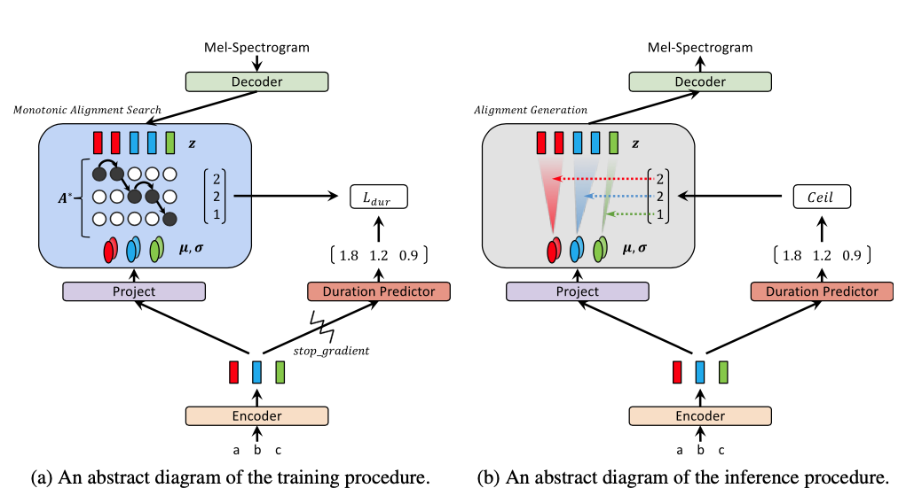

# 인공지능 회고록

# 1. TTS 모델 선택

## 선택한 모델

- TTS : [Glow-TTS](https://arxiv.org/pdf/2005.11129.pdf)

  - alignment의 학습이 필요 없는 flow based generative TTS model
    - alignment : 텍스트와 음성 간의 정렬 과정
      1. 각 단어가 어떻게 발음되는지를 결정하는 정보 추출
      2. 음성 신호를 분석하여, 발생하는 시간과 주파수 정보를 추출
      3. 발음 정보와 음성 신호 정보를 대조하여, 각 단어와 음성 신호의 시간 매핑을 수행합니다. 이 과정에서 단어의 시작 시점과 끝 지점을 결정합니다
      4. alignment를 통해 매핑된 정보를 기반으로, 각 단어의 발음 정보에 따라 음성을 생성
  - 학습 및 추론 과정
    

  1. 텍스트 스퀀스 $c$가 조건으로 들어갔을 때 Mel-Spectogram $X$의 분포, $P_X(x|c)$을 구하는 것이 목표

     

  2. 이 분포들을 모델링하기 위하여 네트워크 파라미터 $\theta$와 alignment function $A$를 이용

     데이터의 log-likelihood를 최대화 하는 세타와 $A$를 구한다.

     

  3. A를 바로 구할 수는 없기 때문에

  1) 현재 $\theta$에서 가장 좋은 $A^*$를 구하고
      2. $A^*$를 사용한 $\log P_X$를 최대화 시킬 수 있는 $\theta$를 구한다.
     이를 반복적으로 하면서 두 파라미터를 점점 최적화

  1. 추론시에 $A^*$를 찾기 위해 별도의 duration predictor $f_{dur}$를 훈련

     

- Vocoder : [HiFi-GAN](https://arxiv.org/pdf/2010.05646.pdf)

  - 개요
    - 음성 합성은 크게 두 단계(1: Mel-Spectogram 생성, 2: Mel에서 Wave form 생성)로 나누어지는데 Vocoder가 2의 역할을 함
    - 최근 Wave Form 생성에 적대적 생성 신경망을 많이 사용하고 있지만 성능이 자동 회귀 모델에 미치지는 못하고 있음
    - 하지만 Hifi-GAN은 GAN을 사용하고도 효율과 정확도를 모두 충족 시킴
  - Traiging Loss

    1.  **GAN Loss: :**
         GAN 훈련 방법론은 LS-GAN [Mao17]을 이용. $x$는 Ground truth 오디오, $s$는 멜스펙트로그램
        
    2.  **Mel-Spectrogram Loss :**

        두 Wave Form의 Mel-Spectogram의 $L_1$ 거리. 파이는 오디오를 Mel로 바꾸어주는 함수. 이 로스는 오디오를 보다 사실적으로 만들어주고 훈련 초반 stability도 높여준다.

        

    3.  **Feature Matching Loss :**

        discriminator의 각 레이어의 feature들 간의 $L_1$ 거리. $D^i$는 discriminator의 $i$번째 레이어의 피쳐맵. $N_i$는 피쳐갯수.

        

### Vocoder란?

TTS(Text-to-Speech) 모델에서 생성된 mel-spectrogram을 음성으로 바꾸는 역할

## 모델 선택 이유

- Tacotron2 보다 빠른 합성 속도
- CPU 성능만으로 음성 합성을 수행 가능
- 자세한 Refrence Code
  - [SCE-TTS](https://sce-tts.github.io/#/) : Colab을 활용한 Glow-TTS 및 HiFi-GAN 학습 코드 제공

# 2. 학습을 위한 데이터

1. **[음성 데이터 구축을 위한 한국어 코퍼스](https://github.com/sce-tts/mimic-recording-studio/blob/master/backend/prompts/korean_corpus.csv)** 3922문장을 직접 녹음
2. 편리한 녹음을 위한 웹 페이지 구축

   

3. python library를 활용하여 학습을 위한 데이터로 변환

# 3. 음성 합성 결과

1. **아래 문장들은 모델 학습을 위해 사용하지 않은 문장들입니다.**

[sample1.wav](./asset/sample1.wav)

1. **경찰청 철창살은 외철창살이고 검찰청 철창살은 쌍철창살이다.**

[sample2.wav](./asset/sample2.wav)

# 4. 학습한 목소리를 편리하게 사용할 수 있는 파이썬 서버 배포

- FastAPI를 활용하여 서버 구축
- URI만으로 TTS 사용 가능
  - https://j8a703.p.ssafy.io/ai/infer/?text=[TTS할 문장]&voice=1
